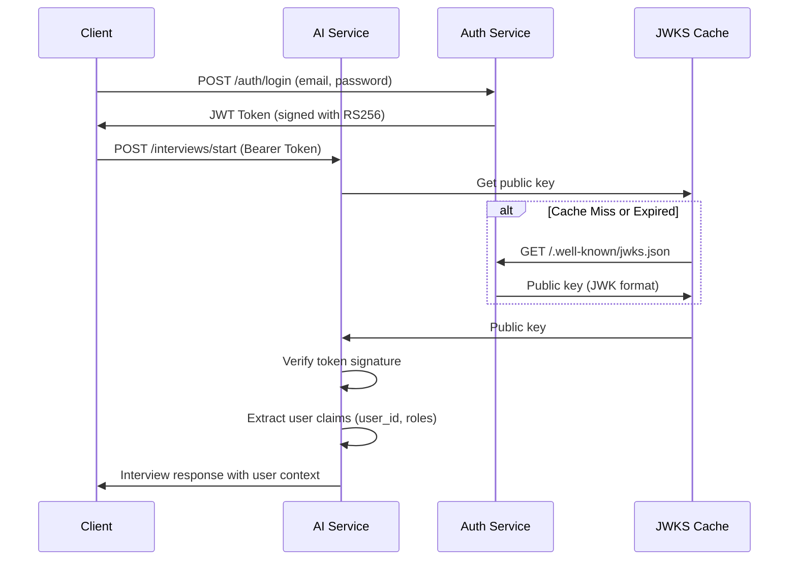
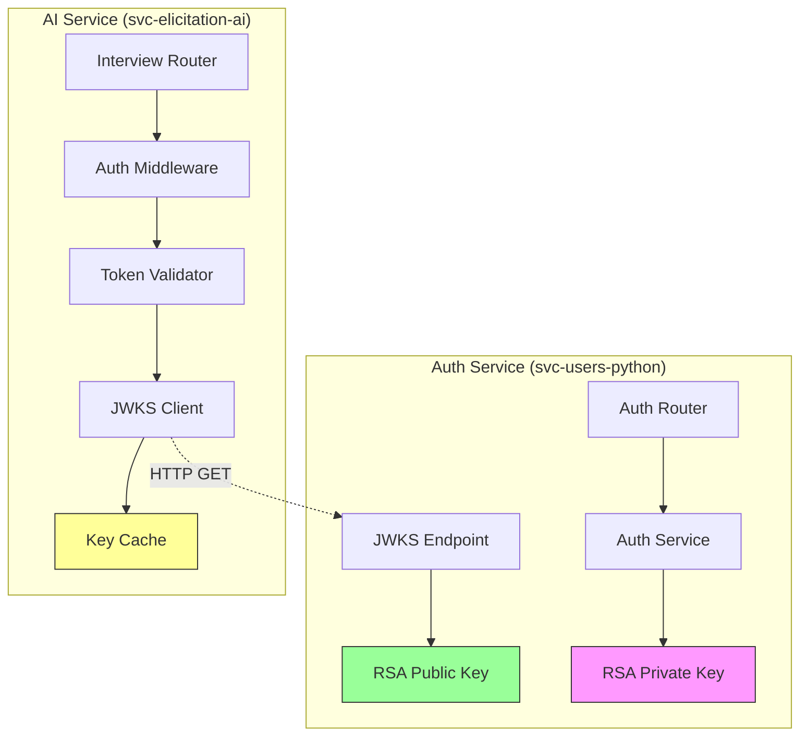

# Design Document

## Overview

This document describes the technical design for integrating JWT-based authentication from the Auth Service (svc-users-python) into the AI Service (svc-elicitation-ai). The integration follows a stateless, microservices-friendly approach using JWKS (JSON Web Key Set) for token validation, eliminating the need for direct database access or inter-service communication for authentication.

**CRITICAL: SCOPE OF WORK**

This integration work is **EXCLUSIVELY** for the AI Service (svc-elicitation-ai). The Auth Service (svc-users-python) already has all necessary functionality:
- ✅ JWT token generation with RS256 signing
- ✅ JWKS endpoint at `/api/v1/auth/jwks`
- ✅ Public key distribution in JWK format
- ✅ CORS configuration

**DO NOT modify, touch, or create any files in svc-users-python.** All implementation tasks are in svc-elicitation-ai only.

### Key Design Principles

1. **Stateless Authentication**: The AI Service validates tokens independently without maintaining session state
2. **Zero Database Coupling**: No direct database access to user tables from the AI Service
3. **Public Key Infrastructure**: Uses asymmetric RS256 signing with JWKS for key distribution
4. **Performance Optimization**: Implements intelligent caching to minimize network overhead
5. **Graceful Degradation**: Handles authentication service unavailability with cached keys

## Architecture

### High-Level Flow



### Component Interaction



## Components and Interfaces

### 1. Auth Service - JWKS Endpoint (EXISTING - NO CHANGES NEEDED)

**Location**: `svc-users-python/app/routers/v1/auth.py` (already exists)

**Endpoint**: `GET /api/v1/auth/jwks`

**Purpose**: Expose public key for token validation

**Status**: ✅ **ALREADY IMPLEMENTED** - This endpoint is fully functional in the Auth Service

**Response Format** (RFC 7517):
```json
{
    "keys": [{
        "kty": "RSA",
        "kid": "auth-2025-10-15",
        "use": "sig",
        "alg": "RS256",
        "n": "<base64url-encoded-modulus>",
        "e": "<base64url-encoded-exponent>",
        "publicKey": "<base64-encoded-PEM>"
    }]
}
```

**Implementation Notes**:
- ✅ Already uses `get_jwks()` function from `auth_service.py`
- ✅ No authentication required (public endpoint)
- ✅ CORS headers already configured
- ✅ Returns single key with kid for identification
- **NO MODIFICATIONS NEEDED** - The AI Service will consume this existing endpoint

### 2. AI Service - JWKS Client (TO BE IMPLEMENTED)

**Location**: `svc-elicitation-ai/app/services/jwks_client.py`

**Purpose**: Fetch and cache public keys from Auth Service's existing JWKS endpoint

**Interface**:
```python
class JWKSClient:
    def __init__(self, jwks_url: str, cache_ttl: int = 3600):
        """
        Initialize JWKS client
        
        Args:
            jwks_url: Full URL to JWKS endpoint
            cache_ttl: Cache time-to-live in seconds (default: 1 hour)
        """
    
    async def get_signing_key(self, kid: str) -> RSAPublicKey:
        """
        Get RSA public key for given key ID
        
        Args:
            kid: Key ID from JWT header
            
        Returns:
            RSA public key object
            
        Raises:
            KeyNotFoundError: If kid not found in JWKS
            JWKSFetchError: If unable to fetch JWKS
        """
    
    async def refresh_keys(self) -> None:
        """Force refresh of cached keys"""
```

**Caching Strategy**:
- In-memory cache with TTL (default: 3600 seconds / 1 hour)
- Automatic refresh on cache expiration
- Fallback to stale cache if Auth Service unavailable
- Thread-safe for concurrent requests

**Error Handling**:
- Network errors: Use stale cache + log warning
- Invalid JWKS format: Raise exception + alert
- Missing key ID: Raise KeyNotFoundError

### 3. AI Service - Token Validator (TO BE IMPLEMENTED)

**Location**: `svc-elicitation-ai/app/services/token_validator.py`

**Purpose**: Validate JWT tokens and extract claims

**Interface**:
```python
class TokenValidator:
    def __init__(self, jwks_client: JWKSClient, issuer: str, audience: str):
        """
        Initialize token validator
        
        Args:
            jwks_client: JWKS client for fetching public keys
            issuer: Expected token issuer (iss claim)
            audience: Expected token audience (aud claim)
        """
    
    async def validate_token(self, token: str) -> TokenPayload:
        """
        Validate JWT token and extract payload
        
        Args:
            token: JWT token string (without "Bearer " prefix)
            
        Returns:
            TokenPayload with user_id, email, roles, permissions
            
        Raises:
            TokenExpiredError: Token has expired
            TokenInvalidError: Invalid signature or format
            TokenMissingClaimsError: Required claims missing
        """

@dataclass
class TokenPayload:
    user_id: str  # From 'sub' claim
    organization_id: str  # From 'organizationId' claim
    email: str  # From custom claim (if added)
    roles: list[str]  # From 'roles' claim
    permissions: list[str]  # From 'permissions' claim
    issued_at: int  # From 'iat' claim
    expires_at: int  # From 'exp' claim
```

**Validation Steps**:
1. Extract key ID (kid) from JWT header
2. Fetch public key from JWKS client
3. Verify signature using PyJWT library
4. Validate issuer, audience, expiration
5. Extract and structure claims into TokenPayload

### 4. AI Service - Authentication Middleware (TO BE IMPLEMENTED)

**Location**: `svc-elicitation-ai/app/middleware/auth_middleware.py`

**Purpose**: Protect endpoints with JWT authentication

**Interface**:
```python
async def get_current_user(
    authorization: str = Header(None)
) -> TokenPayload:
    """
    FastAPI dependency for extracting authenticated user
    
    Args:
        authorization: Authorization header (Bearer <token>)
        
    Returns:
        TokenPayload with user information
        
    Raises:
        HTTPException(401): If token missing, invalid, or expired
        HTTPException(503): If auth service unavailable
    """

# Usage in routers:
@router.post("/interviews/start")
async def start_interview(
    request: StartInterviewRequest,
    current_user: TokenPayload = Depends(get_current_user)
):
    # current_user.user_id, current_user.roles available
```

**Error Responses**:
```python
# Missing token
{
    "status": "error",
    "code": 401,
    "message": "Authentication required",
    "errors": [{"field": "authorization", "error": "Missing or invalid authorization header"}]
}

# Expired token
{
    "status": "error",
    "code": 401,
    "message": "Token expired",
    "errors": [{"field": "token", "error": "JWT token has expired"}]
}

# Invalid signature
{
    "status": "error",
    "code": 401,
    "message": "Invalid token",
    "errors": [{"field": "token", "error": "Token signature verification failed"}]
}

# Auth service unavailable
{
    "status": "error",
    "code": 503,
    "message": "Authentication service unavailable",
    "errors": [{"field": "service", "error": "Unable to validate token"}]
}
```

### 5. AI Service - Configuration Updates (TO BE IMPLEMENTED)

**Location**: `svc-elicitation-ai/app/config.py`

**New Settings**:
```python
class Settings(BaseSettings):
    # ... existing settings ...
    
    # Authentication
    auth_service_url: str  # e.g., "http://localhost:8001"
    jwt_issuer: str = "https://api.example.com"
    jwt_audience: str = "https://api.example.com"
    jwks_cache_ttl: int = 3600  # 1 hour
```

**Environment Variables** (`svc-elicitation-ai/.env`):
```bash
# Authentication Service (points to existing Auth Service)
AUTH_SERVICE_URL=http://localhost:8001
JWT_ISSUER=https://api.example.com
JWT_AUDIENCE=https://api.example.com
JWKS_CACHE_TTL=3600
```

**Note**: The AUTH_SERVICE_URL points to the existing svc-users-python service. The JWKS endpoint will be accessed at `${AUTH_SERVICE_URL}/api/v1/auth/jwks`

## Data Models

### JWT Token Structure (from Auth Service)

```json
{
  "header": {
    "alg": "RS256",
    "typ": "JWT",
    "kid": "auth-2025-10-15"
  },
  "payload": {
    "sub": "01932e5f-8b2a-7890-b123-456789abcdef",
    "organizationId": "01932e5f-1234-5678-9abc-def012345678",
    "iss": "https://api.example.com",
    "aud": "https://api.example.com",
    "iat": 1729526400,
    "exp": 1730131200,
    "jti": "01932e5f-uuid7-generated",
    "roles": ["admin"],
    "permissions": ["users:read", "users:write", "interviews:manage"]
  }
}
```

### JWKS Response Structure

```json
{
  "keys": [
    {
      "kty": "RSA",
      "kid": "auth-2025-10-15",
      "use": "sig",
      "alg": "RS256",
      "n": "xGOr-H7A...base64url...",
      "e": "AQAB",
      "publicKey": "LS0tLS1CRU...base64..."
    }
  ]
}
```

### Interview Data Model Updates

**Location**: `svc-elicitation-ai/app/models/interview.py`

**Changes**:
```python
class StartInterviewRequest(BaseModel):
    # REMOVED: user_id (now from JWT token)
    # REMOVED: organization_id (now from JWT token)
    # REMOVED: role_id (now from JWT token)
    language: str = "es"  # Only language remains

class InterviewExportData(BaseModel):
    session_id: str
    user_id: str  # From JWT token
    organization_id: str  # From JWT token
    user_name: str  # From context service (fetched using user_id)
    user_role: str  # From JWT roles
    # ... rest of fields ...
```

## Error Handling

### Error Hierarchy

```python
class AuthenticationError(Exception):
    """Base exception for authentication errors"""

class TokenExpiredError(AuthenticationError):
    """Token has expired"""

class TokenInvalidError(AuthenticationError):
    """Token signature or format invalid"""

class TokenMissingClaimsError(AuthenticationError):
    """Required claims missing from token"""

class KeyNotFoundError(AuthenticationError):
    """Key ID not found in JWKS"""

class JWKSFetchError(AuthenticationError):
    """Unable to fetch JWKS from auth service"""
```

### Error Handling Strategy

1. **Token Validation Errors** (401):
   - Missing token → "Authentication required"
   - Expired token → "Token expired"
   - Invalid signature → "Invalid token"
   - Missing claims → "Invalid token format"

2. **Service Availability Errors** (503):
   - JWKS fetch fails → Use cached keys if available
   - No cached keys → Return 503 "Authentication service unavailable"

3. **Logging Strategy**:
   - INFO: Successful authentications
   - WARNING: Using stale cached keys
   - ERROR: Authentication failures with token details (sanitized)
   - CRITICAL: JWKS service completely unavailable

## Testing Strategy

### Unit Tests

**Auth Service Tests** (`svc-users-python/tests/test_jwks.py`):
- ✅ JWKS endpoint returns valid JWK format
- ✅ Public key matches private key pair
- ✅ Key ID (kid) matches configuration
- ✅ CORS headers present

**AI Service Tests** (`svc-elicitation-ai/tests/`):

1. **JWKS Client Tests** (`test_jwks_client.py`):
   - ✅ Fetch and parse JWKS successfully
   - ✅ Cache keys for TTL duration
   - ✅ Refresh keys after TTL expiration
   - ✅ Handle network errors gracefully
   - ✅ Use stale cache when service unavailable

2. **Token Validator Tests** (`test_token_validator.py`):
   - ✅ Validate valid token successfully
   - ✅ Reject expired token
   - ✅ Reject token with invalid signature
   - ✅ Reject token with wrong issuer
   - ✅ Reject token with wrong audience
   - ✅ Extract claims correctly

3. **Auth Middleware Tests** (`test_auth_middleware.py`):
   - ✅ Allow requests with valid token
   - ✅ Reject requests without token (401)
   - ✅ Reject requests with invalid token (401)
   - ✅ Return 503 when auth service unavailable
   - ✅ Extract user info into request context

### Integration Tests

**End-to-End Flow** (`tests/integration/test_auth_flow.py`):
1. Start both services (Auth + AI)
2. Login to Auth Service → Get JWT token
3. Call AI Service with token → Verify success
4. Call AI Service without token → Verify 401
5. Call AI Service with expired token → Verify 401
6. Stop Auth Service → Verify cached keys still work
7. Clear cache + Stop Auth Service → Verify 503

### Manual Testing Checklist

- [ ] Login to Auth Service and obtain JWT token
- [ ] Call `/interviews/start` with valid token → Success
- [ ] Call `/interviews/start` without token → 401
- [ ] Call `/interviews/start` with expired token → 401
- [ ] Call `/interviews/start` with tampered token → 401
- [ ] Stop Auth Service, call with valid token → Success (cached)
- [ ] Wait for cache expiration, call with valid token → 503
- [ ] Restart Auth Service, verify recovery

## Migration Strategy

### Phase 1: Verify Auth Service (NO CHANGES NEEDED)

1. ✅ Confirm JWKS endpoint exists at `/api/v1/auth/jwks`
2. ✅ Verify endpoint returns valid JWK format
3. ✅ Confirm CORS is properly configured
4. ✅ Test endpoint accessibility from AI Service network

**Status**: Auth Service is ready. No modifications required.

### Phase 2: Implement Token Validation (AI Service ONLY)

1. Add JWKS client
2. Add token validator
3. Add authentication middleware
4. Update configuration
5. Test with mock tokens

### Phase 3: Update Interview Endpoints (AI Service ONLY)

1. Add auth dependency to routers
2. Remove mock user logic
3. Update request models (remove user_id, org_id, role_id)
4. Use authenticated user from token
5. Update context service to fetch user details

### Phase 4: Remove Mock Users (AI Service ONLY)

1. Delete `svc-elicitation-ai/data/mock_users.json`
2. Remove mock user loading logic
3. Update documentation
4. Clean up unused code

### Phase 5: Testing & Deployment (AI Service ONLY)

1. Run unit tests
2. Run integration tests
3. Manual testing
4. Deploy to staging
5. Monitor logs
6. Deploy to production

## Security Considerations

### Token Security

- ✅ RS256 asymmetric signing (private key never leaves Auth Service)
- ✅ Short token expiration (7 days, configurable)
- ✅ Token includes jti (JWT ID) for potential revocation
- ✅ HTTPS required in production
- ⚠️ No token refresh mechanism (user must re-login)

### Key Management

- ✅ Private key stored in environment variable (base64-encoded)
- ✅ Public key distributed via JWKS (no secrets exposed)
- ✅ Key ID (kid) supports future key rotation
- ⚠️ No automated key rotation (manual process)

### Network Security

- ✅ JWKS endpoint is public (only contains public key)
- ✅ CORS configured for specific origins
- ✅ Rate limiting recommended for JWKS endpoint
- ⚠️ No mutual TLS between services (future enhancement)

### Logging & Monitoring

- ✅ Log authentication failures (sanitized tokens)
- ✅ Monitor JWKS fetch failures
- ✅ Alert on high authentication error rates
- ⚠️ No audit trail for token usage (future enhancement)

## Performance Considerations

### Caching Strategy

- **JWKS Cache TTL**: 1 hour (3600 seconds)
  - Reduces network calls to Auth Service
  - Balances freshness vs performance
  - Allows key rotation within reasonable timeframe

- **Cache Invalidation**: Manual refresh endpoint
  - Useful for emergency key rotation
  - Admin endpoint: `POST /admin/refresh-jwks`

### Expected Performance

- **Token Validation**: ~1-2ms (cached key)
- **JWKS Fetch**: ~50-100ms (cache miss)
- **Overall Request Overhead**: <5ms (99th percentile)

### Scalability

- **Stateless Design**: Horizontal scaling supported
- **No Database Dependency**: No bottleneck on user table
- **Cache Per Instance**: Each AI Service instance has own cache
- **Future Optimization**: Shared Redis cache for JWKS

## Future Enhancements

### Short-term (Next Sprint)

1. **Token Refresh**: Implement refresh token mechanism
2. **Rate Limiting**: Add rate limiting to JWKS endpoint
3. **Metrics**: Add Prometheus metrics for auth operations

### Medium-term (Next Quarter)

1. **Key Rotation**: Automated key rotation with multiple active keys
2. **Token Revocation**: Implement token blacklist with Redis
3. **Audit Logging**: Comprehensive audit trail for security events

### Long-term (Future)

1. **OAuth 2.0**: Full OAuth 2.0 implementation
2. **SSO Integration**: Support for external identity providers
3. **mTLS**: Mutual TLS between microservices
